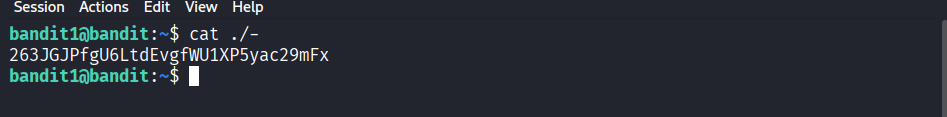

# Bandit Level 1

Đây là thử thách thứ hai trong chuỗi [Bandit](https://overthewire.org/wargames/bandit/) của OverTheWire. Mục tiêu là tìm file chứa flag.

## Thông tin thử thách
- **Host**: `bandit.labs.overthewire.org`
- **Port**: `2220`
- **Username**: `bandit1`
- **Password**: `Sử dụng password có được từ bandit level 0`

Mô tả: chúng ta cần lấy mật khẩu từ file có tên "-"

## Cách giải quyết
Sử dụng lệnh cat thông thường, thay vì chỉ để tên file "-", chúng ta chỉ định đường dẫn tới file, có thể sử dụng đường dẫn tương đối hay tuyệt đối
```bash
cat ./-
```
## Kết quả



---
*Chúc may mắn với các level tiếp theo!*
