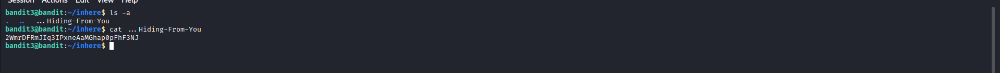

# Bandit Level 3

Link challenge: https://overthewire.org/wargames/bandit/bandit3.html

Thử thách này yêu cầu chúng ta tìm mật khẩu được lưu trữ trong thư mục inhere


## Thông tin thử thách
| Thông tin | Giá trị |
| :--- | :--- |
| **Host** | `bandit.labs.overthewire.org` |
| **Port** | `2220` |
| **Username** | `bandit3` |
| **Password** | *Mật khẩu thu được từ Level 2* |

---

## Phân tích & Cách giải quyết

### Khái niệm file ẩn trong Linux
Trong hệ điều hành Linux/Unix, bất kỳ file hoặc thư mục nào có tên bắt đầu bằng dấu chấm (`.`) đều được coi là **file ẩn (hidden file)**. Theo mặc định, lệnh `ls` sẽ không hiển thị các file này.

Nếu ta dùng ls bình thường với thư mục này, ta sẽ thấy đây là thư mục rỗng 
```bash
bandit3@bandit:~/inhere$ ls
bandit3@bandit:~/inhere$ 
```
Trong linux, chúng ta có thể ẩn file bằng cách đặt tên file bắt đầu bằng dấu '.'

Ví dụ: ".invisble",".bashrc",...
### Giải quyết

Để nhìn thấy các file này, ta sử dụng ls với flag -a, hoặc --all. Tức là liệt kê toàn bộ tập tin trong thư mục

Xem thêm về lệnh ls trong GNU project tại đây

Liệt kê thư mục inhere
```bash
bandit3@bandit:~/inhere$ ls -a
.  ..  ...Hiding-From-You
bandit3@bandit:~/inhere$ 
```

## Kết quả
Chúng ta chỉ việc dùng lệnh cat để xem thông tin file ...Hiding-From-You



---
*Chúc may mắn với các level tiếp theo!*
