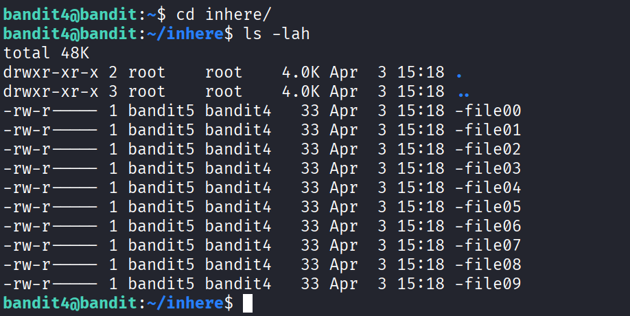
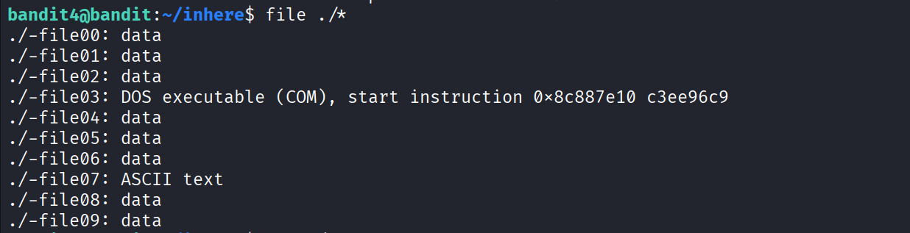
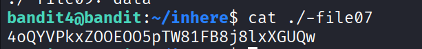

# Bandit Level 4

Link challenge: https://overthewire.org/wargames/bandit/bandit4.html

Thử thách này yêu cầu chúng ta tìm file duy nhất chứa **văn bản có thể đọc được (human-readable)** trong thư mục `inhere`, trong đó có nhiều file với các định dạng khác nhau.


## Thông tin thử thách
| Thông tin | Giá trị |
| :--- | :--- |
| **Host** | `bandit.labs.overthewire.org` |
| **Port** | `2220` |
| **Username** | `bandit4` |
| **Password** | *Mật khẩu thu được từ Level 3* |

---

## Phân tích & Cách giải quyết

### Khái niệm kiểu file (file type) trong Linux

Trong Linux, không phải mọi file đều chứa văn bản mà con người có thể đọc được. Các file có thể là:

- **ASCII text** – văn bản thuần túy, dễ đọc (human-readable)
- **Binary / data** – dữ liệu nhị phân, không thể đọc trực tiếp
- **ELF executable** – file thực thi, v.v.

Lệnh `file` trong Linux cho phép ta xác định **kiểu nội dung** của một file mà không cần mở nó, rất hữu ích khi cần phân biệt giữa nhiều file cùng một lúc.

Khi vào thư mục `inhere`, ta thấy có tới 10 file từ `-file00` đến `-file09`:



Mở từng file một sẽ rất tốn thời gian và phần lớn là dữ liệu nhị phân vô nghĩa.

### Giải quyết

Sử dụng lệnh `file` kết hợp với wildcard `*` để kiểm tra kiểu của tất cả file cùng lúc. Vì tên file bắt đầu bằng dấu `-`, ta cần thêm `./` phía trước để tránh bị shell hiểu nhầm là flag:



Kết quả cho thấy chỉ có `./-file07` là kiểu **ASCII text** — đây chính là file chứa mật khẩu.

## Kết quả

Dùng lệnh `cat` để đọc nội dung file `-file07`:

```bash
bandit4@bandit:~/inhere$ cat ./-file07
```



---
*Chúc may mắn với các level tiếp theo!*
