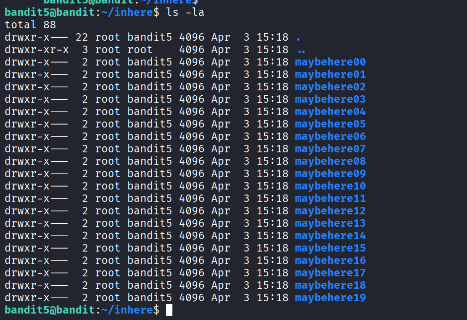
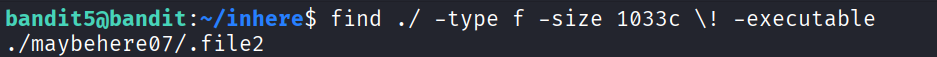

# Bandit Level 5

Link challenge: https://overthewire.org/wargames/bandit/bandit5.html

Thử thách này yêu cầu chúng ta tìm mật khẩu được cất giấu trong một file nằm ở đâu đó dưới thư mục `inhere` với các đặc điểm cụ thể sau:
- Văn bản có thể đọc được (human-readable)
- Có kích thước đúng 1033 bytes
- Không phải là file thực thi (not executable)

## Thông tin thử thách
| Thông tin | Giá trị |
| :--- | :--- |
| **Host** | `bandit.labs.overthewire.org` |
| **Port** | `2220` |
| **Username** | `bandit5` |
| **Password** | *Mật khẩu thu được từ Level 4* |

---

## Phân tích & Cách giải quyết

### Khái niệm tìm kiếm file theo thuộc tính

Trong Linux, lệnh `find` là một công cụ cực kỳ mạnh mẽ để tìm kiếm file hoặc thư mục dựa trên nhiều tiêu chí khác nhau (như tên, kích thước, quyền, ngày chỉnh sửa, v.v.).

Khi kiểm tra bên trong thư mục `inhere`, ta sẽ thấy có rất nhiều thư mục con, mỗi thư mục con lại chứa nhiều file khác nhau. Việc tìm kiếm thủ công là bất khả thi.

<!-- Thêm include ảnh vào đây, mô tả kết quả sau khi dùng lệnh ls -->



Ta cần kết hợp lệnh `find` với các cờ (flags) tương ứng với gợi ý của đề bài:
- Tìm trong thư mục hiện tại: `.`
- Chỉ tìm file: `-type f`
- Kích thước chính xác 1033 bytes: `-size 1033c` (trong đó `c` đại diện cho bytes)
- Không phải file thực thi: `! -executable` hoặc có thể tìm file có quyền đọc (readable) bằng `-readable`

Tìm hiểu thêm về lệnh find: https://man7.org/linux/man-pages/man1/find.1.html

### Giải quyết

Chạy lệnh `find` kết hợp với các tuỳ chọn trên:

```bash
bandit5@bandit:~/inhere$ find . -type f -size 1033c ! -executable
```



Lệnh sẽ lập tức trả về đường dẫn duy nhất đến file thoả mãn tất cả các điều kiện trên.

## Kết quả

Dùng lệnh `cat` để đọc nội dung file đã tìm được:

```bash
bandit5@bandit:~/inhere$ cat ./maybehere07/.file2
```


---
*Chúc may mắn với các level tiếp theo!*
