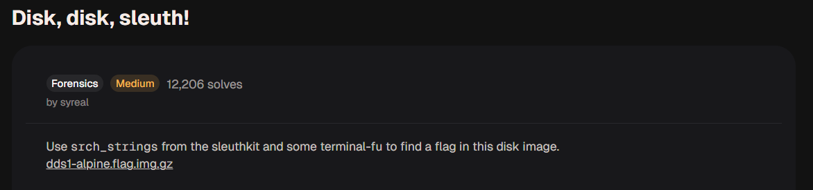
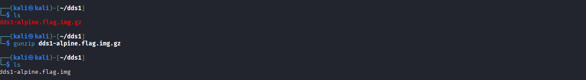
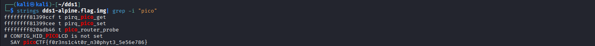

# Disk, disk, sleuth! - picoCTF 2021

## 1. Thông tin thử thách
* **Link challenge:** [Disk, disk, sleuth! (picoGym)](https://learn.cylabacademy.org/learning-paths/16/120)
* **Category:** Forensics

### Mô tả
> Use `srch_strings` from the sleuthkit and some `grep` to find the picoCTF flag in this disk image: `dds1-alpine.flag.img.gz`


### Gợi ý (Hints)
1. Có thể sử dụng các công cụ thao tác văn bản hoặc the sleuthkit.

## 2. Phân tích & Hướng giải quyết

### Thu thập thông tin
Bài tập cung cấp một file ảnh đĩa đã được nén: `dds1-alpine.flag.img.gz`.
Tên thử thách và mô tả đã gợi ý rõ ràng về việc sử dụng công cụ `srch_strings` hoặc phân tích cấu trúc đĩa (sleuthkit).

### Phân tích Logic
File nén chứa một ảnh đĩa (disk image) của một hệ điều hành Alpine Linux.
Flag có thể được giấu ở một file nào đó bên trong hệ thống file của đĩa này. Có hai hướng tiếp cận chính:
1. **Hướng đơn giản (như mô tả gọi ý):** Trích xuất các chuỗi (strings) có thể đọc được từ toàn bộ ảnh đĩa và tìm kiếm chuỗi bắt đầu bằng `picoCTF{`.
2. **Hướng phân tích đĩa (Sleuth Kit):** Sử dụng bộ công cụ Sleuth Kit (`mmls`, `fls`, `icat`) để phân tích cấu trúc phân vùng, duyệt thư mục và tìm/trích xuất file chứa flag. Hướng này chuyên nghiệp hơn cho Forensics.

## 3. Khai thác 

### Sử dụng công cụ `strings` / `srch_strings` 
Bước 1: Giải nén file:
```bash
gunzip dds1-alpine.flag.img.gz
```
Kết quả ta được file `dds1-alpine.flag.img`.


Bước 2: Tìm kiếm chuỗi văn bản.
Sử dụng `srch_strings` (hoặc lệnh `strings` mặc định của Linux) kết hợp với `grep` để lọc ra flag:
```bash
srch_strings dds1-alpine.flag.img | grep picoCTF
# hoặc
strings dds1-alpine.flag.img | grep pico
```
### Kết quả
<!-- Thêm một đoạn ở đây -->

```
picoCTF{f0r3ns1c4t0r_n30phyt3_5e56e786}
```

## 4. Tổng kết (Key takeaways)
* Các file Disk Image `.img` thực chất chứa dữ liệu thô (raw data) của toàn bộ ổ cứng hoặc phân vùng.
* Lệnh `strings` (hoặc `srch_strings`) cực kỳ mạnh mẽ để tìm kiếm cờ hoặc thông tin nhạy cảm dạng văn bản bên trong các file nhị phân lớn hoặc disk image mà không cần phải mount hay phân tích file system.
* Sleuth Kit (`mmls`, `fls`, `icat`) là bộ công cụ thiết yếu để phân tích sâu cấu trúc của một image disk trong các bài thi Forensics phức tạp hơn (ví dụ bài Disk, disk, sleuth! II).
