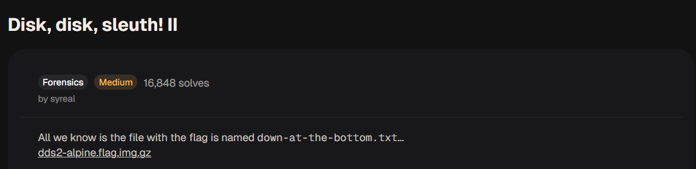
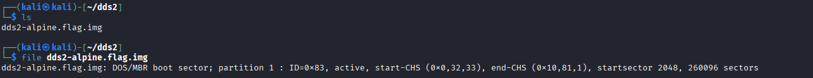
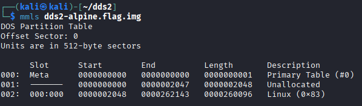
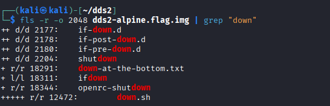
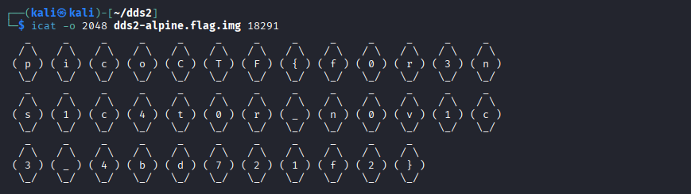
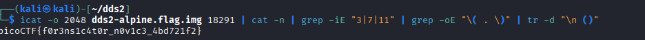

# Disk, disk, sleuth!! - picoCTF 2021

## 1. Thông tin thử thách
* **Link challenge:** [Disk, disk, sleuth! (picoGym)](https://learn.cylabacademy.org/learning-paths/16/121)
* **Category:** Forensics

### Mô tả
> All we know is the file with the flag is named down-at-the-bottom.txt...
`dds2-alpine.flag.img.gz`



### Gợi ý (Hints)
1. Có thể sử dụng các công cụ thao tác văn bản hoặc the sleuthkit.

## 2. Phân tích & Hướng giải quyết

### Thu thập thông tin
Bài tập cung cấp một file ảnh đĩa đã được nén: `dds2-alpine.flag.img.gz`.
Tên thử thách và mô tả đã gợi ý rõ ràng về việc sử dụng sleuthkit để phân tích cấu trúc đĩa và tìm kiếm file chứa flag có tên là **down-at-the-bottom.txt**

### Phân tích Logic
File nén chứa một ảnh đĩa (disk image) của một hệ điều hành Alpine Linux.
Ý tưởng là ta sẽ dùng`mmls` để xác định phân vùng sau đó dùng  `fls` để duyệt các tập tin có trong phân vùng và dùng `grep` để lọc ra file cần tìm kiếm **down-at-the-bottom.txt**, sau đó dùng `icat` để đọc nội dung tập tin.

## 3. Khai thác 

### Bước 1: Tìm kiếm thông tin về offset các phân vùng partition có trong file disk image 
Giải nén file:
```bash
gunzip dds2-alpine.flag.img.gz
```
Kết quả ta được file `dds2-alpine.flag.img`.


Thông tin ban đầu quan trọng nhất mà chúng ta thấy đó là file ổ địa chỉ có 1 phân vùng
Ta có thể dùng sử dụng lệnh `mmls` để xác định phân vùng kĩ hơn là loại phân vùng gì, thuộc hệ điều hành nào

```bash
mmls dds2-alpine.flag.img
```


Ta thu được thông tin về phân vùng đó là thuộc Linux, bắt đầu tại offset 2048 

### Bước 2: Tìm kiếm file flag bằng `fls` và `grep`

Sau khi đã có thông tin phân vùng Linux bắt đầu tại **offset 2048**, chúng ta tiến hành liệt kê toàn bộ các tệp tin và thư mục bên trong phân vùng này bằng lệnh `fls`. 

Để không phải tìm kiếm thủ công trong một danh sách dài, ta sẽ kết hợp cờ `-r` (duyệt đệ quy tất cả thư mục con) và dùng ống dẫn `| grep "down"` để lọc ra file có tên giống với mô tả của đề bài:

```bash
fls -r -o 2048 dds2-alpine.flag.img | grep "down"
```


Dựa vào kết quả trên, ta đã tìm thấy chính xác mục tiêu: tệp tin **`down-at-the-bottom.txt`**. Thông tin quan trọng nhất cần ghi nhận ở đây là chuỗi số đứng trước tên file: **`18291`**. Đây chính là số **Inode** (định danh của file trong hệ thống tập tin), ta sẽ dùng nó để trích xuất nội dung file ở bước tiếp theo.

### Bước 3: Trích xuất nội dung và lọc chuỗi Flag

Sử dụng lệnh `icat` cùng với offset `2048` và Inode `18291` vừa tìm được để đọc nội dung file:

```bash
icat -o 2048 dds2-alpine.flag.img 18291
```


Nếu chỉ chạy lệnh `icat` thông thường như trên, kết quả in ra sẽ là một dạng ASCII Art chứa các ký tự của Flag nằm rời rạc trong các dấu ngoặc đơn, được bao quanh bởi các ký tự hình thoi

Để lấy được chuỗi Flag cuối cùng một cách gọn gàng, chúng ta thiết lập một chuỗi lệnh (pipeline) kết hợp các công cụ xử lý văn bản của Linux:

```bash
icat -o 2048 dds2-alpine.flag.img 18291 | cat -n | grep -iE "3|7|11" | grep -oE "\( . \)" | tr -d "\n ()"
```
**Giải thích chuỗi lệnh (Pipeline):**
1. `icat -o 2048 ... 18291`: Trích xuất nội dung thô của file.

2. `cat -n`: Đánh số thứ tự cho từng dòng output.

3. `grep -iE "3|7|11"`: Lọc giữ lại đúng các dòng số 3, 7 và 11 (Đây là các dòng chứa ký tự của Flag mà ta quan sát được bằng mắt thường).

4. `grep -oE "\( . \)"`: Dùng Regex để tìm và chỉ in ra (`-o`) các cụm ký tự nằm trong dấu ngoặc đơn (Ví dụ: `( p )`, `( i )`...).

5. `tr -d "\n ()"`: Xóa tất cả các ký tự rác bao gồm: Dấu xuống dòng `\n`, khoảng trắng ` `, dấu mở ngoặc `(`, và dấu đóng ngoặc `)`. Kết quả cuối cùng các ký tự sẽ được nối liền mạch với nhau.
## 3. Kết quả
Thực thi chuỗi lệnh trên, rác đã được dọn sạch và Flag hiện ra một cách hoàn hảo:



```text
picoCTF{f0r3ns1c4t0r_n0v1c3_4bd721f2}
```
## 4. Tổng kết (Key takeaways)

* **Hiểu về cấu trúc Disk Image:** Việc sử dụng The Sleuth Kit yêu cầu sự hiểu biết cơ bản về cấu trúc lưu trữ. Phải dùng `mmls` để tìm Offset (địa chỉ bắt đầu của phân vùng), sau đó mới có thể dùng `fls` hay `icat` để phân tích tiếp.
* **Inode là "chìa khóa":** Trong hệ thống tập tin Linux (và Forensics nói chung), tên file (`down-at-the-bottom.txt`) chỉ là phần hiển thị, số Inode (`18291`) mới là định danh thực sự dùng để trích xuất dữ liệu gốc nằm trên ổ cứng.
* **Sức mạnh của Linux Pipeline:** Trong các bài thi CTF, dữ liệu trả về hiếm khi sạch sẽ. Việc thành thạo kết hợp các công cụ thao tác văn bản (`cat`, `grep`, `Regex`, `tr`) thông qua ống dẫn (`|`) là kỹ năng bắt buộc để "lọc cát tìm vàng" một cách nhanh chóng và tự động hoá.


