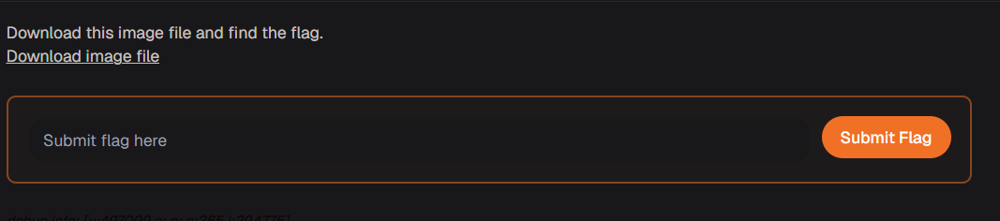
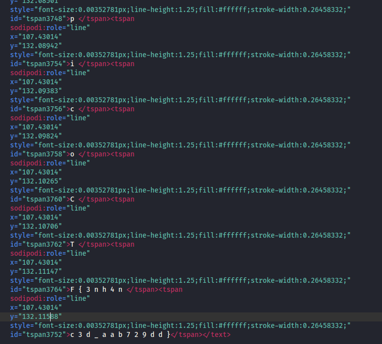
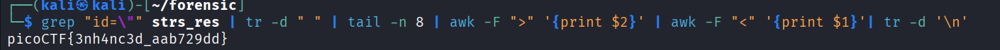

# Enhance! - picoCTF 2022

## 1. Thông tin thử thách
* **Link challenge:** [Enhance! (picoGym)](https://learn.cylabacademy.org/learning-paths/16/117)
* **Category:** Forensics
### Mô tả
> Download this image file and find the flag.


### Gợi ý (Hints)
1. Có thể sử dụng các công cụ thao tác văn bản thông thường để tìm cờ.

## 2. Phân tích & Hướng giải quyết

### Thu thập thông tin
Bài tập cung cấp một file ảnh định dạng **SVG** (`drawing.flag.svg`).


### Phân tích lỗ hổng / Logic
SVG (Scalable Vector Graphics) thực chất là một tệp đồ họa dựa trên XML (văn bản). Do đó, nội dung của nó hoàn toàn có thể đọc được bằng các trình soạn thảo văn bản (Text Editor) hoặc các công cụ command-line.

Thay vì cố gắng "enhance" (phóng to) hình ảnh bằng các phần mềm chỉnh sửa ảnh, chúng ta có thể kiểm tra trực tiếp mã nguồn của file SVG này để tìm thông tin ẩn giấu.


## 3. Khai thác 

### Xây dựng Script
Sử dụng công cụ `cat`, `strings`, hoặc mở file bằng bất kỳ text editor nào để xem nội dung mã XML bên trong. 

```bash
strings drawing > strs_res
mousepad strs_res
```
Khi đọc mã nguồn của file, ta sẽ thấy các ký tự của flag được chia nhỏ ra và giấu trong các thẻ `<tspan>`:



Chỉ cần ghép các ký tự bên trong các thẻ này lại với nhau, ta sẽ có được flag hoàn chỉnh.

Ta có thể dùng các lệnh thao tác với chuỗi trong bash
```bash
grep "id=\"" strs_res | tr -d " " | tail -n 8 | awk -F ">" '{print $2}' | awk -F "<" '{print $1}'| tr -d '\n'
```

### Kết quả



**Flag:** `picoCTF{3nh4nc3d_aab729dd}` 

## 4. Tổng kết (Key takeaways)
* File SVG bản chất là các đoạn mã XML. Việc kiểm tra mã nguồn (source code) của các file đồ họa loại này thường là bước cơ bản đầu tiên trong các bài Forensics.
* Lệnh `strings` hoặc `grep` rất hữu ích để trích xuất văn bản (text) từ các file không rõ định dạng hoặc file ảnh có thể đọc được.
