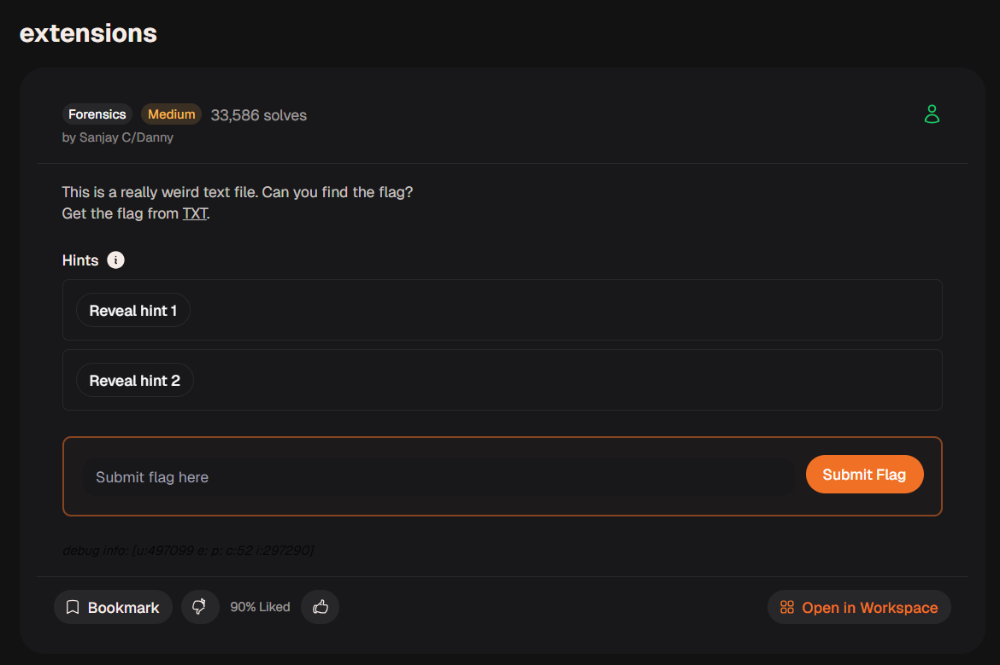
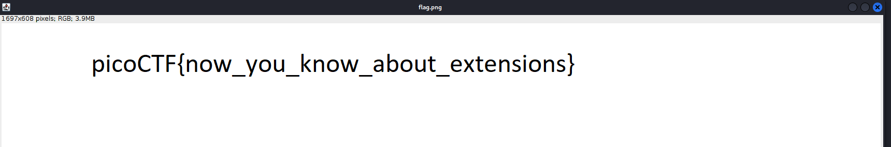

# extensions - CyLab Security Academy

## 1. Thông tin thử thách

* **Link challenge:** [extensions (CyLab Academy)](https://learn.cylabacademy.org/learning-paths/16/124)
* **Category:** Forensics
* **Difficulty:** Medium
* **Solves:** 33,586

| Thông tin | Giá trị |
| :--- | :--- |
| **Tác giả** | Sanjay C / Danny |
| **Platform** | CyLab Security Academy — Forensics in CTF's |
| **Tags** | `file-extension`, `magic-bytes`, `forensics`, `file` |

### Mô tả

> This is a really weird text file. Can you find the flag?
> Get the flag from [TXT](https://learn.cylabacademy.org/learning-paths/16/124).



*(Hints bị ẩn, không tiết lộ)*

## 2. Phân tích & Hướng giải quyết

### Thu thập thông tin

Challenge cung cấp một file có đuôi `.txt`. Tuy nhiên, khi mở file bằng trình soạn thảo văn bản thông thường, nội dung hiển thị là ký tự lạ, không phải văn bản có thể đọc được — đây là dấu hiệu rõ ràng cho thấy **file không phải là text**.

```
file flag.txt
```

Kết quả:

```
flag.txt: PNG image data, 1697 x 608, 8-bit/color RGB, non-interlaced
```

Vấn đề nằm ở **file extension (phần mở rộng của file) bị giả mạo**. Hệ điều hành Windows thường dựa vào đuôi file (`.txt`, `.png`, ...) để xác định loại file, nhưng đây không phải cách chính xác.

Cách đáng tin cậy hơn là kiểm tra **magic bytes** (hay còn gọi là file signature) — những byte đầu tiên trong file xác định định dạng thực sự của nó.

## 3. Khai thác


### Đổi extension và mở ảnh

Đổi đuôi file từ `.txt` sang `.png`:

```bash
mv flag.txt flag.png
```

Sau đó mở ảnh bằng bất kỳ image viewer nào:

```bash
imagej flag.png      # Linux
# hoặc mở trực tiếp bằng Windows Photos / trình xem ảnh
```

### Kết quả

Bức ảnh hiển thị trực tiếp nội dung flag:



**Flag:** `picoCTF{now_you_know_about_extensions}`

## 4. Tổng kết (Key takeaways)

* **Đừng tin vào file extension** — phần mở rộng của file hoàn toàn có thể bị thay đổi tùy ý và không phản ánh nội dung thực của file.
* **Magic bytes** là cách đáng tin cậy để xác định định dạng thực sự của một file. Byte đầu tiên của PNG luôn là `89 50 4E 47` (`\x89PNG`).
* Lệnh `file` trên Linux là công cụ nhanh nhất để kiểm tra loại file dựa trên magic bytes mà không cần đổi tên.
* Trong Forensics CTF, nhiều challenge ẩn flag trong ảnh, audio, hay các định dạng nhị phân khác nhưng đổi tên thành `.txt` hoặc định dạng lạ để đánh lạc hướng người chơi.
