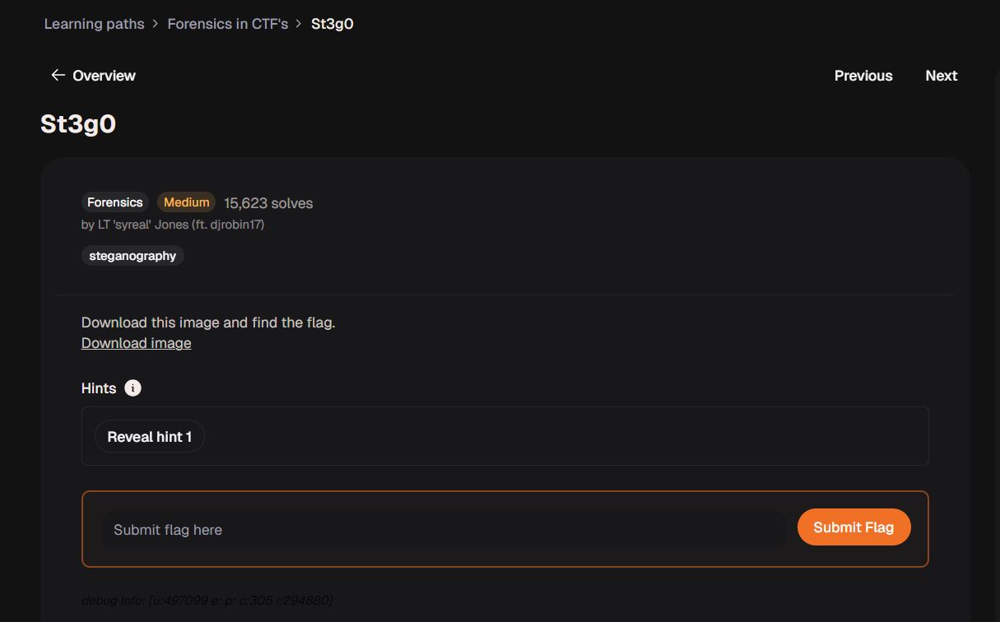
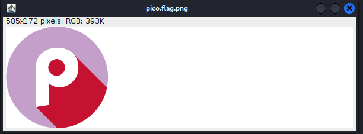
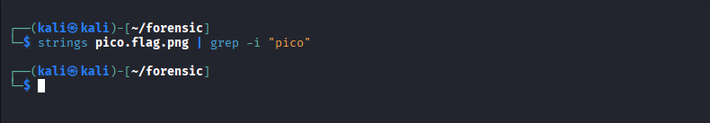
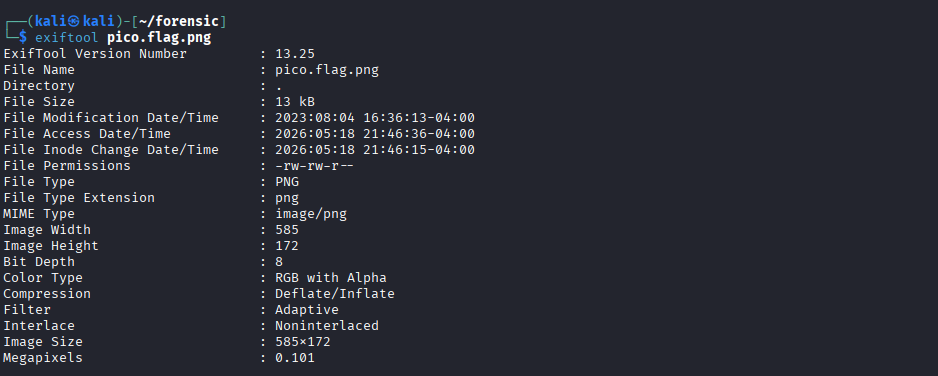
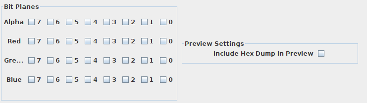
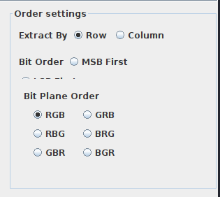
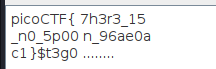
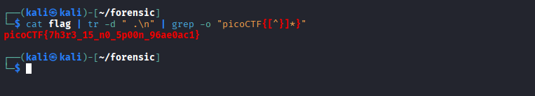

# St3g0 - CyLab Security Academy

## 1. Thông tin thử thách

* **Link challenge:** [St3g0 (CyLab Academy)](https://learn.cylabacademy.org/learning-paths/16/125)
* **Category:** Forensics
* **Difficulty:** Medium
* **Solves:** 15,621

| Thông tin | Giá trị |
| :--- | :--- |
| **Tác giả** | LT 'syreal' Jones (ft. djrobin17) |
| **Platform** | CyLab Security Academy — Forensics in CTF's |
| **Tags** | `steganography`, `image`, `forensics`, `zsteg` |

### Mô tả

> Download this image and find the flag.

<!--  -->


*(Hints bị ẩn, không tiết lộ)*

## 2. Phân tích & Hướng giải quyết

### Thu thập thông tin

Challenge cung cấp một file ảnh. Đây là bài **steganography** — kỹ thuật giấu thông tin bí mật bên trong một file media (ảnh, audio, video) mà mắt thường không thể phát hiện


### Phân tích Logic

Với bài steganography dạng ảnh PNG, các hướng tiếp cận phổ biến gồm:

| Công cụ | Mô tả |
| :--- | :--- |
| `strings` | Tìm chuỗi văn bản ẩn trong file |
| `zsteg` | Phát hiện dữ liệu ẩn trong kênh màu LSB của ảnh PNG/BMP |
| `steghide` | Trích xuất dữ liệu ẩn được nhúng bằng steghide (thường dùng với JPEG) |
| `stegsolve` | Phân tích từng bit-plane màu của ảnh |
| `exiftool` | Kiểm tra metadata EXIF của ảnh |
| `binwalk` | Tìm file ẩn bên trong file ảnh |

Bước đầu tiên ta dùng `strings` và `exiftool` để kiểm tra nhanh:

```bash
strings pico.flag.png | grep picoCTF
```



```bash
exiftool pico.flag.png
```




Ta không thu thập được thông tin gì hữu ích, vì vậy ta dùng **Stegsolve** để phân tích trực quan từng bit-plane của ảnh.

## 3. Khai thác

### Sử dụng Stegsolve để phân tích Bit-Plane

**Stegsolve** là một công cụ đồ họa (Java) cho phép xem ảnh qua từng kênh màu (Red, Green, Blue, Alpha) và từng bit-plane riêng lẻ (bit 0 → bit 7). Kỹ thuật LSB ẩn dữ liệu ở **bit 0** (bit có trọng số thấp nhất), nên đây là nơi cần kiểm tra đầu tiên.

#### Cách chạy Stegsolve

Stegsolve là file `.jar`, chạy bằng Java:

```bash
java -jar stegsolve.jar
```

Sau đó mở file `pico.flag.png` qua menu **File → Open**.

#### Duyệt các Bit-Plane

Dùng các nút **`<`** và **`>`** ở cuối cửa sổ để chuyển qua lại giữa các lớp phân tích. Thứ tự các plane thường gặp:

| Plane | Ý nghĩa |
| :--- | :--- |
| Red plane 0 | Bit LSB của kênh Red |
| Green plane 0 | Bit LSB của kênh Green |
| Blue plane 0 | Bit LSB của kênh Blue |
| Alpha plane 0 | Bit LSB của kênh Alpha (nếu ảnh có transparency) |

Sau khi duyệt qua toàn bộ các plane (Red, Green, Blue, Alpha — từ bit 0 đến bit 7), ta **không nhận thấy bất kỳ dấu hiệu bất thường nào** về mặt trực quan — các plane trông hoàn toàn ngẫu nhiên hoặc đồng nhất, không có pattern nào nổi bật.

Khi không tìm thấy dấu hiệu trực quan, ta chuyển sang nghi ngờ ảnh được nhúng dữ liệu bằng **thuật toán nhúng ảnh theo bit** — phổ biến nhất trong CTF là:


| Kỹ thuật | Mô tả |
| :--- | :--- |
| **LSB (Least Significant Bit)** | Nhúng dữ liệu vào bit có trọng số thấp nhất (bit 0) — thay đổi không đáng kể |
| **MSB (Most Significant Bit)** | Nhúng vào bit có trọng số cao nhất (bit 7) — ít dùng hơn |

Với kỹ thuật này, dữ liệu được trải đều trên nhiều pixel liên tiếp theo thứ tự quét ngang (raster scan), nên mắt người không thể nhận ra sự thay đổi khi nhìn vào bit-plane. Đây chính là lý do các plane nhìn bình thường.

#### Trích xuất dữ liệu bằng Analyse → Data Extract

Thay vì xem ảnh trực quan, ta dùng chức năng **Analyse → Data Extract** để Stegsolve đọc tuần tự từng bit theo một tổ hợp kênh màu và ghép lại thành chuỗi byte.

Giao diện Data Extract có hai nhóm cài đặt quan trọng cần hiểu trước khi thử:

**① Bit Plane Settings — Chọn kênh màu và bit cần đọc**

Mỗi pixel PNG gồm tối đa 4 kênh màu (R, G, B, A), mỗi kênh có 8 bit (bit 0 → bit 7). Ta chọn kênh nào và bit nào để Stegsolve trích xuất:



| Tuỳ chọn | Ý nghĩa |
| :--- | :--- |
| `Red 0`, `Green 0`, `Blue 0` | Bit 0 (LSB) của từng kênh — nơi dữ liệu thường được nhúng |
| `Red 1`, `Green 1`, ... | Bit 1, bit 2... của kênh tương ứng |
| `Alpha 0` | Bit LSB của kênh Alpha (độ trong suốt) |
| Tích nhiều kênh | Dữ liệu được ghép nối tiếp từ từng kênh theo thứ tự pixel |

> Thông thường ta chỉ tích **bit 0** của các kênh — đây là nơi kỹ thuật LSB ẩn dữ liệu. Tích thêm các bit cao hơn sẽ trộn lẫn và không cho kết quả có nghĩa.

**② Order Settings — Các thiết lập về thứ tự trích xuất**

Đây là nhóm thiết lập cực kỳ quan trọng giúp Stegsolve xác định cách quét ảnh và ghép các bit thu được thành thông điệp hoàn chỉnh. Nhóm này gồm 3 tuỳ chọn chính:



*   **Extract By (Row / Column):** Hướng quét các pixel trên ảnh.
    *   `Row` (Mặc định): Quét ngang từng hàng pixel từ trái qua phải, từ trên xuống dưới.
    *   `Column`: Quét dọc từng cột pixel từ trên xuống dưới, từ trái qua phải.
*   **Bit Order (MSB First / LSB First):** Thứ tự ghép các bit thu được để tạo thành một byte hoàn chỉnh (8 bit).
    *   `MSB First` (Most Significant Bit First): Bit quan trọng nhất được đọc trước → ghép từ trái sang phải trong byte (ví dụ: bit 7, 6, 5... đến 0).
    *   `LSB First` (Least Significant Bit First): Bit ít quan trọng nhất được đọc trước → ghép từ phải sang trái trong byte (ví dụ: bit 0, 1, 2... đến 7).
*   **Bit Plane Order (RGB, RBG, GBR, GRB, BRG, BGR):** Thứ tự trích xuất bit giữa các kênh màu trong cùng một pixel.
    *   Ví dụ: Nếu chọn `RGB`, tại mỗi pixel Stegsolve sẽ lấy bit của kênh Red trước, sau đó đến Green, rồi đến Blue trước khi chuyển sang pixel tiếp theo. Nếu công cụ nhúng ẩn theo thứ tự khác, ta phải thay đổi tuỳ chọn này tương ứng để đọc được dữ liệu chính xác.


Sau một quá trình thử nghiệm lần lượt các tổ hợp

Với tổ hợp **RGB + LSB**, kết quả hiển thị chuỗi văn bản có thể đọc được, chứa flag:




### Kết quả
Lưu kết quả ra text và lọc bỏ các kí tự thừa để có flag



**Flag:** `picoCTF{7h3r3_15_n0_5p00n_86e97081}`

---

## 4. Tổng kết (Key takeaways)

* **Steganography** là kỹ thuật giấu thông tin trong file media mà không làm thay đổi nội dung nhìn thấy được của file đó.
* Kỹ thuật **LSB (Least Significant Bit)** thay thế bit ít quan trọng nhất của mỗi pixel bằng bit dữ liệu cần giấu — thay đổi quá nhỏ để mắt người nhận ra.
* **Stegsolve** rất hữu ích để phân tích trực quan từng bit-plane, đặc biệt khi cần xác định kênh màu nào được sử dụng để nhúng dữ liệu.
* **`zsteg`** là công cụ command-line số một để tự động phát hiện LSB steganography trong ảnh PNG — nhanh hơn và toàn diện hơn khi kiểm tra nhiều tổ hợp cùng lúc.
* Kênh **Alpha** (độ trong suốt) thường bị bỏ qua nhưng lại là nơi ẩn dữ liệu phổ biến trong CTF — luôn nhớ kiểm tra!
