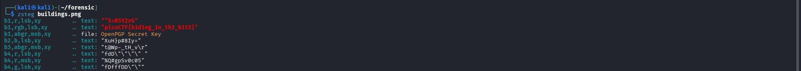

# What Lies Within - picoCTF

## 1. Thông tin thử thách

* **Link challenge:** [What Lies Within](https://play.picoctf.org/practice/challenge/74) (hoặc link trên nền tảng bạn đang giải)
* **Category:** Forensics
* **Difficulty:** Medium

| Thông tin | Giá trị |
| :--- | :--- |
| **Tác giả** | Julio/Danny |
| **Platform** | picoCTF |
| **Tags** | `steganography`, `image`, `zsteg`, `stegsolve`, `LSB` |

### Mô tả

> There's something in the building. Can you retrieve the flag?

*(Hints bị ẩn, không tiết lộ)*

---

## 2. Phân tích & Hướng giải quyết

### Thu thập thông tin

Challenge cung cấp một file ảnh (tên là `building.png`). Khi mở file ảnh lên, ta thấy đây là một bức ảnh chụp mặt tiền của một tòa nhà cao tầng. Nhìn bằng mắt thường không có gì bất thường.
Đúng như mô tả "There's something in the building", đây là một bài toán **steganography** — kỹ thuật giấu thông tin (flag) bên trong một file media mà không làm thay đổi bề ngoài của nó.

### Phân tích Logic

Với các bài steganography định dạng ảnh PNG, kỹ thuật giấu tin phổ biến nhất là **LSB (Least Significant Bit)** — giấu dữ liệu vào những bit có trọng số thấp nhất của các kênh màu, khiến sự thay đổi màu sắc trở nên vô hình đối với mắt người.
Để kiểm tra và trích xuất dữ liệu LSB, ta có thể sử dụng:

* Giao diện đồ họa: **Stegsolve** (dùng chức năng Data Extract)
* Command-line: **zsteg** (chuyên dụng để tự động phân tích và trích xuất dữ liệu LSB trong PNG/BMP)

---

## 3. Khai thác (Exploitation)

### Sử dụng `zsteg`

Vì đây là file PNG, công cụ command-line hiệu quả và nhanh chóng nhất là `zsteg`. Ta mở terminal và chạy lệnh sau:

```bash
zsteg building.png
```



`zsteg` sẽ quét qua toàn bộ các tổ hợp kênh màu (RGB, Alpha) và bit order. Kết quả ngay lập tức trả về dòng chứa flag : **picoCTF{h1d1ng_1n_th3_b1t5}**

Dòng output này được ký hiệu theo định dạng `b<bits>,<channels>,<order>,<direction>` của `zsteg`. Cụ thể:

| Thành phần | Giá trị | Ý nghĩa |
| :--- | :--- | :--- |
| `b1` | 1 bit | Số bit lấy từ mỗi kênh màu trong một pixel (ở đây là 1 bit = bit thấp nhất, tức **bit 0 = LSB**) |
| `rgb` | Red, Green, Blue | Các kênh màu được dùng để trích xuất dữ liệu (bỏ qua kênh Alpha) |
| `lsb` | Least Significant Bit | **Thứ tự ghép bit**: bit ít quan trọng nhất được đọc trước khi tạo thành byte |
| `xy` | theo hàng ngang | **Hướng quét pixel**: quét từng pixel theo hàng ngang (trái → phải, trên → dưới) |

Dịch đơn giản: *"Lấy 1 bit từ mỗi kênh R, G, B (theo thứ tự LSB) từng pixel một từ trái qua phải, trên xuống dưới, ghép lại thành chuỗi văn bản."*
---

## 4. Tổng kết (Key takeaways)

* **LSB Steganography:** Kỹ thuật giấu thông tin phổ biến trong các bài CTF Forensics, tận dụng các bit ít quan trọng nhất của pixel để giấu dữ liệu mà không làm thay đổi trực quan của ảnh.
* **`zsteg` là "vũ khí tối thượng"** cho ảnh PNG/BMP: Công cụ này sẽ tự động thử các thuật toán LSB và tìm ra flag cực kỳ nhanh chóng mà không cần phải đoán cấu hình.
* Hiểu cách dùng **Stegsolve (Data Extract)** giúp nắm vững bản chất của việc trích xuất dữ liệu từ các bit
